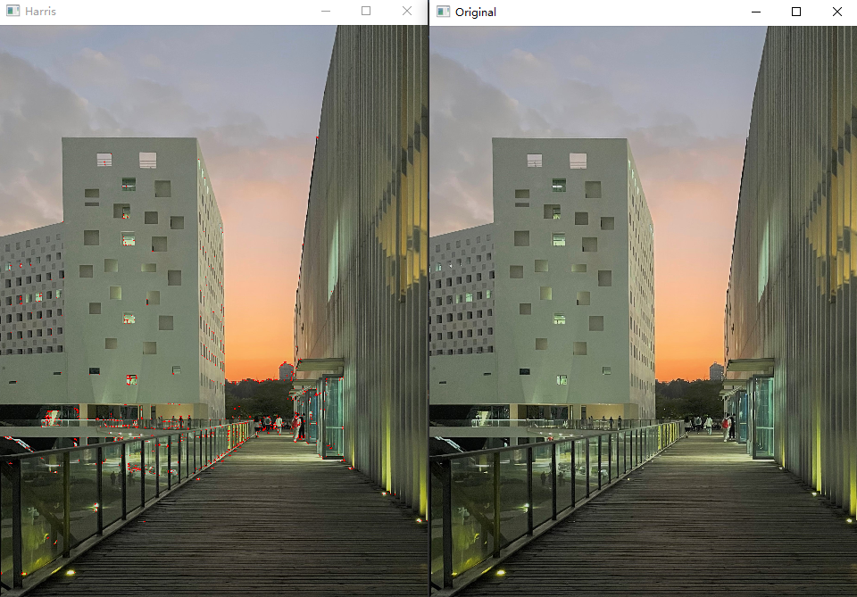
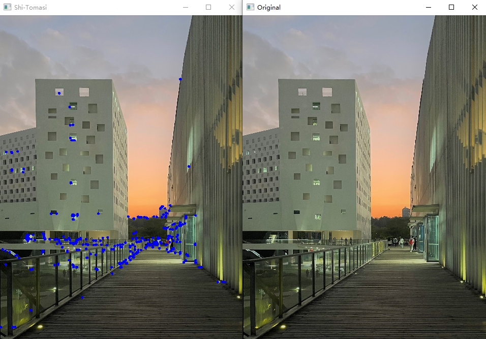
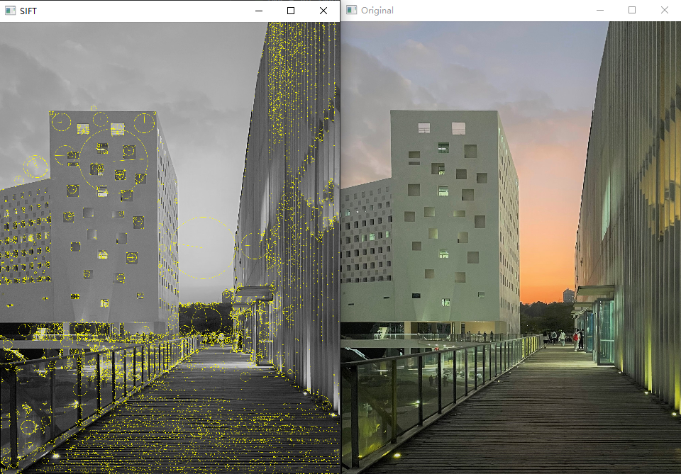
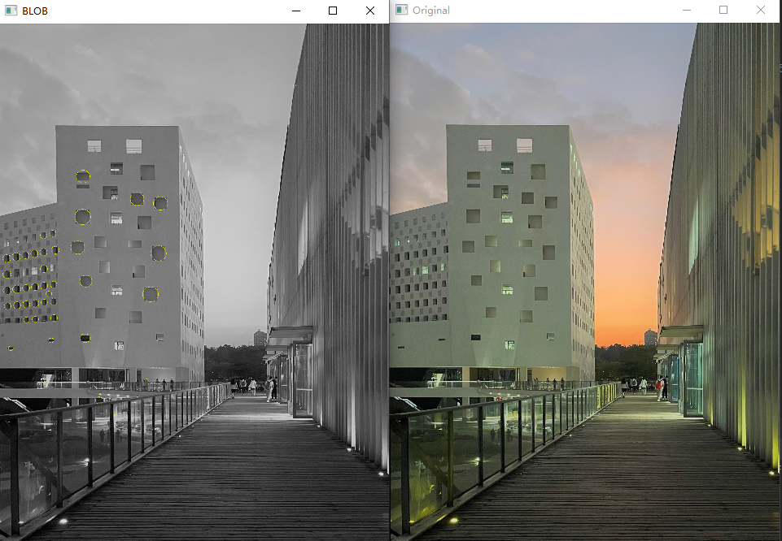
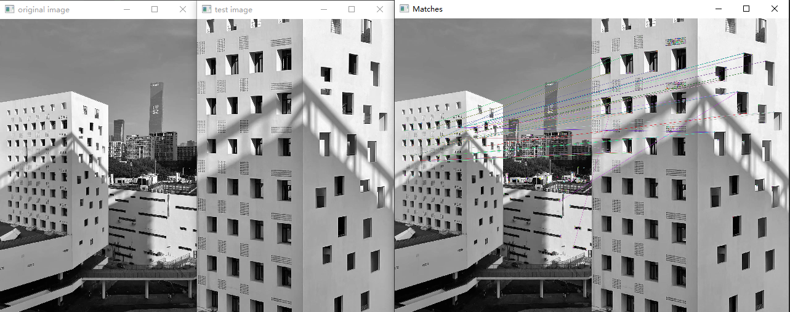

# VC-A-AND-P-ASSIGNMENTS
ASSIGNMENTS OF VIDEO CONTENT ANALYSIS AND PRACTISE via OpenCV

## 图像的经典特征提取方法：
1 HOG(histogram of Oriented Gradient,方向梯度直方图）

2 SIFT(Scale-invariant features transform,尺度不变特征变换）

3 SURF(Speeded Up Robust Features,加速稳健特征，对sift的改进）

4 DOG(Difference of Gaussian，高斯函数差分)

```
高斯差分(Difference of Gaussian, DoG), 是高斯拉普拉斯(LoG)的一种近似，两者之间的关系推导如下：
```


```
高斯差分(Difference of Gaussian, DoG)边缘检测算法的步骤如下：
```

```
1. 构建窗口大小为HxW，标准差为的DoG卷积核(H, W一般为奇数，且相等)
```


```
2. 图像与两个高斯核卷积，卷积结果计算差分
```

```
3. 边缘后处理
```

5 LBP(Local Binary Pattern,局部二值模式）

6 HAAR(haar-like ,haar类特征，注意haar是个人名，haar这个人提出了一个用作滤波器的小波，为这个滤波器命名为haar滤波器，后来有人把这个滤波器用到了图像上，就是图像的haar特征）

7 Harris

8 Shi-Tomasi

9 Blob

10 特征匹配

11 拉普拉斯算子（Laplacian算子）

```
Laplacian算子采用二阶导数，其计算公式如下：(分别对x方向和y方向求二阶导数，并求和)
```


```
其对应的Laplacian算子如下：
```


12 LoG（高斯拉普拉斯边缘检测）

```
拉普拉斯算子没有对图像做平滑处理，会对噪声产生明显的响应，
所以一般先对图片进行高斯平滑处理，再采用拉普拉斯算子进行处理，
但这样要进行两次卷积处理。高斯拉普拉斯(LoG)边缘检测，
是将两者结合成一个卷积核，只进行一次卷积运算。
```


13 Marri-Hildreth边缘检测算法

```
高斯拉普拉斯和高斯差分边缘检测，得到边缘后，只进行了简单的阈值处理，Marr-Hildreth则对其边缘进行了进一步的细化，使边缘更加精确细致，就像Canny对sobel算子的边缘细化一样。

Marr-Hildreth边缘检测可以细分为三步：

1. 构建窗口大小为H*W的高斯拉普拉斯卷积核(LoG)或高斯差分卷积核(DoG)
2. 图形矩阵与LoG核或DoG核卷积
3. 在第二步得到的结果中，寻找过零点的位置，过零点的位置即为边缘位置

　　第三步可以这么理解，LoG核或DoG核卷积后表示的是二阶导数，二阶导数为0表示的是一阶导数的极值，而一阶导数为极值表示的是变化最剧烈的地方，因此对应到图像边缘提取中，二阶导数为0，表示该位置像素点变化最明显，即最有可能是边缘交接位置。

　　对于连续函数g(x), 如果g(x1)*g(x2) < 0，即 g(x1) 和g(x2) 异号，那么在x1，x2之间一定存在x 使得g(x)=0， 则x为g(x)的过零点。在图像中，Marr-Hildreth将像素点分为下面四种情况，分别判断其领域点之间是否异号：
```


14 ORB

## 图像的一般提取特征方法：

1 灰度直方图，颜色直方图

2 均值，方差

3 信号处理类的方法：灰度共生矩阵，Tamura纹理特征，自回归纹理特征，小波变换。

4 傅里叶形状描述符，小波描述符等.

# Some Results

### 1  Harris



### 2  Shi-Tomasi



### 3  SIFT



### 4  HoG


### 5  Blob



### 6  特征匹配



### 7  Laplacian 


### 8 Laplacian优化


### 9 LoG


### 10 DoG


### 11  ORB


 ### 12  Marri Hildreth


### 13 Canny


### 14 Scharr


### 15 Sobel

